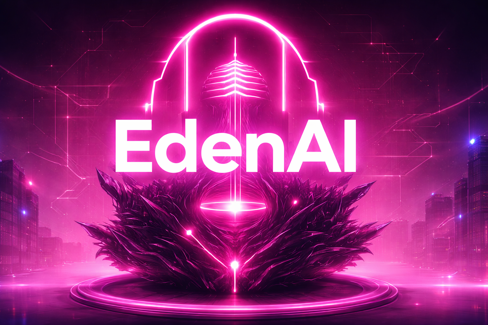

  

<h1 align="center">🌿 EdenAI</h1>
<h3 align="center">Telegram Utility · Media · AI Bot</h3>

  <b>An all-in-one Telegram bot combining media downloads, AI tools, and community management.</b>

  
  
  
  

---

## 🚀 What is EdenAI?

**EdenAI** is a powerful, production-ready Telegram bot designed for real communities and heavy usage.

It combines:
- 🎬 Media Downloading  
- 🤖 AI Features & Chat Bot  
- 🛠️ Admin & Moderation tools  

Into a single, clean, and reliable bot built for **groups** at heart.

---

## ✨ Features
### 🎬 Media Downloading
- 📥 **YouTube video & audio downloads**
  - Interactive quality selector: **MP3 · 480p · 720p · 1080p · Best**
  - Cookie support for restricted videos
  - Automatic compression when files exceed Telegram limits
  - Large-file fallback via Telethon (up to ~2GB)
  - HLS streaming fallback if downloads fail
- 📱 **TikTok downloader**
  - SnapTik-based
  - No watermark when available

---

### 🤖 AI Features
- 🖼️ **AI Image Generation**
  - `/image <prompt>`
  - Powered by Cloudflare AI
- 💬 **AI Chat Replies**
  - The bot responds when mentioned by username
  - Perfect for group chats and quick questions

---

### 😂 Meme System
- `/meme` — random meme
- `/meme <subreddit>` — meme from a specific subreddit
- Uses Reddit’s public JSON endpoints

---

### 📊 Stats & Tracking
- SQLite-based usage tracking
- Per-user download statistics
- Global bot statistics for admins
- Built-in rate limiting to prevent abuse

---

### 🛠️ Admin & Community Tools
- 🔇 `/mute` & `/unmute`
- 📢 Announcements & vendor posts
- 🎁 Giveaways
- 👋 Welcome media for new members
- ⏰ Scheduled daily messages
- 🔐 Admin-only command enforcement

---

## 🧾 Commands

### 👤 User Commands

| Command | Description |
|------|------------|
| `/start` | Start the bot |
| `/help` | Show help |
| `/download <url>` | YouTube download with quality menu |
| `/youtube <url>` | Quick YouTube download |
| `/tiktok <url>` | Download TikTok video |
| `/meme` | Random meme |
| `/meme <subreddit>` | Meme from subreddit |
| `/image <prompt>` | Generate AI image |
| `/stats` | View your usage stats |

---

### 🛡️ Admin Commands

| Command | Description |
|------|------------|
| `/adminstats` | Global bot statistics |
| `/mute <user>` | Mute a user |
| `/unmute <user>` | Unmute a user |
| `/cookiestatus` | Check YouTube cookies |
| `/cookiehelp` | Cookie & EJS setup help |

---
